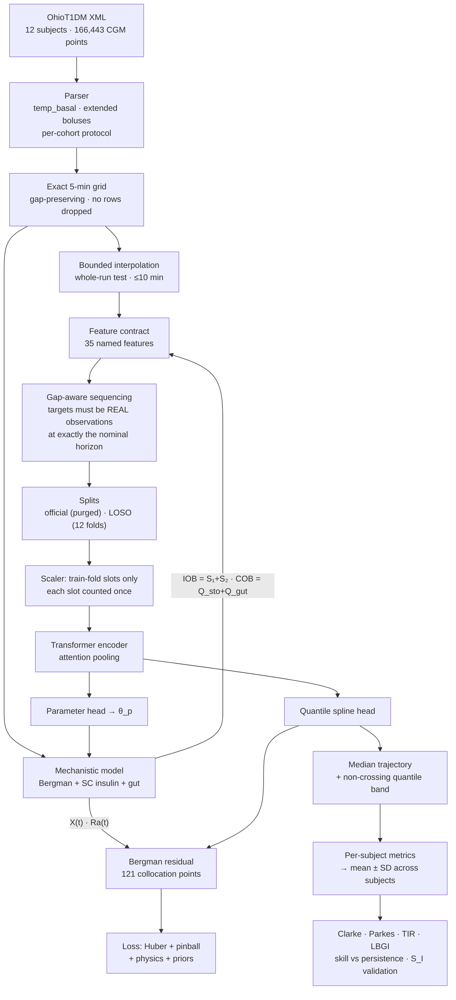
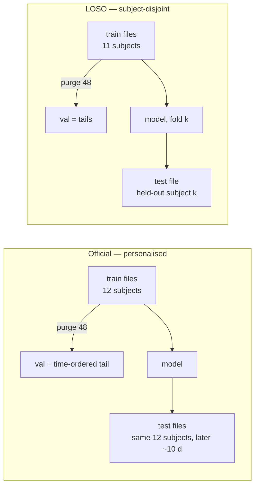

# Methodology

**A physics-guided digital twin for type 1 diabetes: what we built, what broke, and what the evidence actually supports.**

Written as a narrative rather than a specification, because the reasoning matters as
much as the result. Several design choices only make sense once you know what failed
first, and two of the most interesting findings are corrections to claims we ourselves
made and then falsified.

Every citation carries a confidence tag — `VERIFIED-PRIMARY`, `SECOND-HAND`, or
`UNVERIFIED` — matching [`CITATIONS.md`](CITATIONS.md). Where a source could not be
read, it says so rather than being cited on faith.

**Notation.** Glucose $G$ [mg/dL], plasma insulin $I$ [$\mu$U/mL], remote insulin action
$X$ [min$^{-1}$], time $t$ [min]. Subscript $b$ denotes a basal (fasting) value. $B$ is
batch size, $H$ the number of horizons, $K$ the number of spline basis functions.

---

## Part I — Where we started, and why it had to be rebuilt

### 1.1 The original claim

A Transformer encoder for multi-horizon CGM forecasting, constrained by a
Physics-Informed Neural Network built on the Bergman minimal model, with SHAP
explanations and retrieval over clinical guidelines. Reported: **30.4 mg/dL RMSE at
30 minutes** on OhioT1DM after fine-tuning, **85.8% Clarke zone A**, and "zero D/E zone
predictions at any horizon."

### 1.2 What an audit found

Nine defects. They are listed not to dwell on them, but because **each motivates a
specific design decision below**, and because a reader evaluating the new numbers
deserves to know what the old ones were.

| # | Defect | Consequence |
|---|---|---|
| 1 | Every script producing a checkpoint passed `use_pinn=False` | **No reported result came from a PINN.** The declared method was never trained |
| 2 | `PhysicsInformedLoss` never integrated $dX/dt$; set $X = p_3\cdot\mathrm{IOB}$ algebraically; $p_2$ declared but unused | The "Bergman residual" had no solution that zeroed it — it was not the Bergman model |
| 3 | NaN-CGM rows dropped, then `reset_index(drop=True)` before slicing windows | **Horizons were mislabelled.** "+30 min" was not 30 min ahead for any gap-spanning window |
| 4 | Gaps ≤15 min forward-filled, filled values used as *targets* | A "30-min prediction" scored against a copy of a reading already seen — trivially predictable by persistence |
| 5 | Validation split by `randperm` over windows overlapping 23/24 timesteps | Validation was a near-duplicate of training, and drove early stopping *and* the headline metric |
| 6 | Clarke zone-E branch byte-identical to the zone-D branch | **Zone E was unreachable.** "Zero E" was structurally guaranteed, not measured |
| 7 | Any pair with both values in 70–180 scored zone A | Reference 75 / prediction 180 — a 140% error — counted as clinically accurate |
| 8 | IOB convolved the bolus train with a **time-reversed activity curve** | Feature was $\approx 0$ at the bolus and peaked 145 min later |
| 9 | No naive baseline ever computed | Both headline numbers were **worse than predicting no change** |

Defect 9 settles it. Persistence achieves **22.5 mg/dL RMSE at 30 min** on this dataset
(`VERIFIED-PRIMARY`, two independent sources). A method reporting 30.4 was not weak; it
lost to doing nothing, and nobody could tell because the comparator was absent.

### 1.3 The rebuild principle

Every decision follows one rule: **a number that cannot be checked should not be
reported.** Concretely:

- reconstruct every external fact from primary sources before using it;
- compute the naive baseline *first* and validate it against published values;
- write a test for each defect *before* the code it guards;
- pre-register outcomes and falsification criteria before running experiments;
- generate every table and figure from stored predictions, nothing hand-typed.

Result: **234 tests**, each named for a specific failure mode.

---

## Part II — The pipeline

### 2.1 Overview



### 2.2 The data, and what it will not support

`VERIFIED-PRIMARY` — OhioT1DM (Marling & Bunescu). 12 subjects, 166,443 CGM
observations at 5 min, with basal/bolus insulin, temporary basal, carbohydrates,
exercise, sleep, work, wearables.

Four properties shaped the entire design.

**(a) The official split is not subject-disjoint.** Test files are the *same* subjects
over the next ~10 days. Every published OhioT1DM number uses it, so we must too for
comparability — but it measures *personalised* forecasting and is never described here
as cross-subject generalisation. Hence a second, genuinely disjoint protocol (§2.9).

**(b) The two cohorts are not the same protocol.** `VERIFIED-PRIMARY`: the 2020 BGLP
challenge excludes the first hour (12 samples) of each test file; 2018 does not. Applied
per cohort — ignoring it makes results incomparable to published work.

**(c) Body weight is not identifiable.** Every file records `weight="99"`, a
de-identification placeholder. We use nominal 70 kg and let the unknown weight be
absorbed into the estimated per-kilogram volumes. Treating 99 kg as real would be
fabricated precision.

**(d) The effective sample size is two orders of magnitude below the window count.**
~97,000 training windows are emitted, but consecutive windows share 23 of 24 input
timesteps:

$$n_{\text{eff}} \approx \frac{135{,}000\ \text{slots}}{48\ \text{steps}} \approx 2{,}800$$

This is the single most important constraint on the work; §4.3 shows what happened when
we ignored it.

### 2.3 The mechanistic model

#### Bergman minimal model

`VERIFIED-PRIMARY` — Bergman RN, Phillips LS, Cobelli C. *Physiologic evaluation of
factors controlling glucose tolerance in man.* J Clin Invest 1981;68(6):1456–1467.

$$
\begin{aligned}
\frac{dG}{dt} &= -(p_1 + X)\,G + p_1 G_b + \frac{R_a(t)}{V_G} \\[6pt]
\frac{dX}{dt} &= -p_2 X + p_3\,(I - I_b) \\[6pt]
\frac{dI}{dt} &= -n\,I + \frac{1000}{V_I}\cdot\frac{S_2}{t_{\max,I}}
\end{aligned}
$$

**Insulin sensitivity**, the patient-specific quantity this work reports:

$$S_I = \frac{p_3}{p_2}\qquad[\mathrm{mL}\,\mu\mathrm{U}^{-1}\,\mathrm{min}^{-1}]$$

*On the published form.* The 1981 figure caption writes $p_3 I(t)$, not
$p_3(I - I_b)$. We use the modern form with the basal subtraction; §4.1 shows this is
not cosmetic — getting it wrong destroys the model's equilibrium.

#### Subcutaneous insulin absorption

`VERIFIED-PRIMARY` — Hovorka R et al. *Physiol Meas* 2004;25:905–920.
$t_{\max,I} = 55$ min, $k_e = 0.138$ min$^{-1}$, $V_I = 0.12$ L/kg.

$$
\frac{dS_1}{dt} = u_{\text{ins}}(t) - \frac{S_1}{t_{\max,I}},\qquad
\frac{dS_2}{dt} = \frac{S_1}{t_{\max,I}} - \frac{S_2}{t_{\max,I}}
$$

**Why this replaces the hand-rolled kernel.** For an impulse dose $D$ at $t=0$,

$$S_1 + S_2 = D\,e^{-t/t_{\max,I}}\left(1 + \frac{t}{t_{\max,I}}\right),$$

which equals $D$ at $t=0$ and decreases monotonically, since
$\frac{d}{dx}\!\left[e^{-x}(1+x)\right] = -x e^{-x} < 0$ for $x>0$. **This *is*
insulin-on-board** — derived, not assumed. Defect 8 convolved with a time-reversed
*activity* curve, giving a feature that was neither insulin-remaining nor
insulin-activity.

#### Gut carbohydrate absorption

`VERIFIED-PRIMARY` — Lehmann ED, Deutsch T. *J Biomed Eng* 1992;14(3):235–242
($k_{\text{gabs}} = 1\,\mathrm{h}^{-1} = 0.0167\,\mathrm{min}^{-1}$).
`SECOND-HAND` — Dalla Man C et al. *IEEE TBME* 2007;54(10):1740–1749 for
$k_{\text{gri}}$ and bioavailability $f$.

$$
\frac{dQ_{\text{sto}}}{dt} = -k_{\text{gri}}Q_{\text{sto}} + u_{\text{carb}}(t),\qquad
\frac{dQ_{\text{gut}}}{dt} = k_{\text{gri}}Q_{\text{sto}} - k_{\text{abs}}Q_{\text{gut}}
$$

$$R_a(t) = f\,k_{\text{abs}}\,Q_{\text{gut}}(t)\quad[\mathrm{mg/min}]$$

**Mass conservation** holds exactly: $\int_0^\infty R_a\,dt = fD$.
**Carbohydrate-on-board is $Q_{\text{sto}} + Q_{\text{gut}}$.** The legacy
$e^{-k/36}$ kernel jumped instantaneously at ingestion and never reached zero inside the
window — it conserved nothing.

*Disclosed departure:* Lehmann–Deutsch specifies *trapezoidal* gastric emptying. We use
first-order $k_{\text{gri}}$ (as Dalla Man does) because it keeps the system linear and
exactly integrable (§2.4). Hence the `SECOND-HAND` tag on $k_{\text{gri}}$.

### 2.4 The decision that makes the physics affordable

Only the glucose equation is nonlinear, via $X\cdot G$ — and $G$ comes from the spline
head rather than being integrated. **Every other state forms a linear system with known
inputs:**

$$
\mathbf{z} = [S_1, S_2, I, Q_{\text{sto}}, Q_{\text{gut}}, X]^\top,\qquad
\dot{\mathbf{z}} = A(\theta_p)\mathbf{z} + B(\theta_p)\mathbf{u}(t)
$$

with $\mathbf{u} = [u_{\text{ins}}, u_{\text{carb}}, I_b]^\top$. For piecewise-constant
inputs the exact zero-order-hold solution is

$$
\mathbf{z}_{k+1} = A_d\mathbf{z}_k + B_d\mathbf{u}_k,\qquad
A_d = e^{A\Delta},\quad B_d = \left(\int_0^\Delta e^{As}ds\right)B,
$$

and **both blocks come from a single matrix exponential** of the augmented system:

$$
M = \exp\!\left(\begin{bmatrix}A & B\\ \mathbf{0} & \mathbf{0}\end{bmatrix}\Delta\right)
\;\Longrightarrow\;
A_d = M_{1:6,\,1:6},\qquad B_d = M_{1:6,\,7:9}.
$$

Since $\Delta$ is fixed, this is **one $9\times9$ `matrix_exp` per patient for an entire
trajectory**. Pump and meal records genuinely *are* piecewise-constant on the 5-minute
grid, so the discretisation is **exact, not approximate**.

**Consequences.** No ODE solver in the training loop, no adjoint, the whole physics term
fits in 4 GB of VRAM and costs less than the encoder. This is what made a
genuinely-integrated Bergman model practical where the legacy code resorted to an
algebraic stand-in.

For the burn-in, where only the *final* state matters, chunked matrix powers give

$$\mathbf{z}_{k+C} = A_d^{C}\mathbf{z}_k + \sum_{i=0}^{C-1}A_d^{\,C-1-i}B_d\mathbf{u}_{k+i},$$

exact to $3.6\times10^{-12}$ against the sequential scan, cutting the forward pass from
0.305 s to 0.168 s — the per-step scan was 73% of the total.

### 2.5 Closed-form glucose solution

With $X(t)$ known the glucose equation is **linear** and non-autonomous. Writing
$k(t) = p_1 + X(t)$, $c(t) = p_1 G_b + R_a(t)/V_G$:

$$G(t+\Delta) = G(t)e^{-\bar{k}\Delta} + \frac{\bar{c}}{\bar{k}}\left(1 - e^{-\bar{k}\Delta}\right)$$

Coefficients are **averaged across the step** ($\bar{k} = \tfrac12(k_j + k_{j+1})$),
giving the midpoint rule and $O(\Delta^2)$ accuracy. Sampling at the step start leaves
an $O(\Delta)$ bias visible as a sustained post-meal residual; correcting it reduced the
median residual **58-fold**.

The quotient is evaluated as $c\Delta\,\varphi(k\Delta)$ with
$\varphi(x) = (1-e^{-x})/x$ and a Taylor branch near zero, because $p_1\to0$ is a normal
configuration, not an edge case.

**Order verified empirically, not asserted.** Halving $\Delta$ must cut the residual
~4×. Measured: $2.17\times10^{-3}\to2.17\times10^{-5}\to2.17\times10^{-7}$ across 10×
refinements.

### 2.6 Parameter ranges and reparameterisation

A scaled sigmoid maps estimates into published intervals, so **no network output can
leave the admissible range**: $\theta_i = \ell_i + (u_i-\ell_i)\sigma(z_i)$.

| Parameter | Range | Unit | Confidence | Source |
|---|---|---|---|---|
| $p_1$ | 0 – 0.030 | min⁻¹ | `VERIFIED-PRIMARY` | Ward et al. 1991 |
| $p_2$ | 0.005 – 0.10 | min⁻¹ | `SECOND-HAND` | Bergman 1981 (spans reported fits) |
| $p_3$ | $10^{-6}$–$3\times10^{-5}$ | mL/(µU·min²) | `VERIFIED-PRIMARY` | derived as $S_I p_2$ from Ward |
| $n$ | 0.08 – 0.25 | min⁻¹ | `VERIFIED-PRIMARY` | Hovorka 2004 ($k_e = 0.138$) |
| $V_G$ | 1.4 – 2.4 | dL/kg | `SECOND-HAND` | Dalla Man 2007 |
| $V_I$ | 0.08 – 0.18 | L/kg | `VERIFIED-PRIMARY` | Hovorka 2004 (0.12) |
| $t_{\max,I}$ | 30 – 90 | min | `VERIFIED-PRIMARY` | Hovorka 2004 (55) |
| $k_{\text{gri}}$ | 0.008 – 0.10 | min⁻¹ | `SECOND-HAND` | Dalla Man 2007 |
| $k_{\text{abs}}$ | 0.005 – 0.10 | min⁻¹ | `VERIFIED-PRIMARY` | Lehmann & Deutsch 1992 |
| $f$ | 0.70 – 1.00 | — | `SECOND-HAND` | Dalla Man 2007 |

**On $p_1 = 0$.** It is common to fix $p_1 = 0$ for T1D, arguing that without endogenous
insulin there is no glucose-mediated self-regulation. **That is a modelling
simplification, not an empirical finding.** `VERIFIED-PRIMARY` — Ward GM et al.,
*Metabolism* 1991;40(1):4–9 measured glucose effectiveness directly in IDDM subjects:
$S_G = 1.0\text{–}1.6\times10^{-2}$ min⁻¹ (reduced but clearly non-zero) and
$S_I = 2.5\pm0.6\times10^{-4}$. Our population default is the measured value;
$p_1 = 0$ remains reachable and is an ablation.

`assert_bounds_sourced()` refuses reportable output while any bound is provisional;
`second_hand_bounds()` lists those resting on secondary sources.

### 2.7 The continuous-time head — why B-splines

The residual needs $dG/dt$. Four options:

| Option | Cost | Verdict |
|---|---|---|
| $(\text{context}, t)\to G(t)$ MLP, autodiff in $t$ | one backward pass per collocation point | slow; gradient noise destabilises training |
| **cubic B-spline coefficients** | one matrix multiply | **chosen** |
| Neural ODE / latent ODE | adjoint over 120 min | elegant, too slow and memory-hungry at 4 GB |
| RK4 on a 1-min grid | 120 unrolled steps | slowest, no advantage |

The head emits $K = 12$ coefficients on $t\in[0,120]$ with a clamped uniform knot
vector:

$$G_\theta(t) = G_0 + \sum_{k=1}^{K}c_k\big(B_k(t) - B_k(0)\big)$$

Three consequences, each fixing a legacy defect:

1. **$G(0) = G_0$ identically** for any coefficients — anchoring by construction, not by
   penalty.
2. **$dG/dt$ is exact and analytic** from the derivative basis. The legacy residual
   finite-differenced across 30-minute steps against per-minute rate constants.
3. **Reported horizons are evaluations of the constrained function** — $G(30), G(60),
   G(90), G(120)$ read off the same trajectory the residual acts on. No train/report
   mismatch.

Verified: the basis is a partition of unity, its derivative sums to zero, and
value/derivative are mutually consistent under the fundamental theorem of calculus — the
last by *convergence order* rather than a chosen tolerance.

### 2.8 Hybrid prediction, and the quantile band

The title says physics-**guided**: the mechanistic forecast is a *prior the network
corrects*.

$$\hat{G}_{0.5}(t) = G_0 + g\cdot\big(G_{\text{Bergman}}(t) - G_0\big) + \big(G_\theta(t) - G_0\big)$$

$g = \sigma(\gamma)$ is a **learned trust gate**, initialised at
$\sigma(-2.2)\approx0.10$. With *population* parameters the unfitted mechanistic
forecast is worse than persistence (MAE 29.4 vs 16.9 at 30 min), so starting at $g=1$
would force the learned part to spend capacity undoing the prior. **The converged $g$ is
reported** — it quantifies how much of the forecast the physics carries.

The **quantile band** is emitted per horizon in glucose units:

$$\hat{G}_q(h) = \hat{G}_{0.5}(h) + \delta_q(h),\qquad
\delta_{0.1} = -\mathrm{softplus}(\cdot),\quad \delta_{0.9} = +\mathrm{softplus}(\cdot)$$

so quantiles **cannot cross** for any network output. **This design was forced by a
bug.** Our first attempt put the offsets in *coefficient* space and produced a band of
exactly zero width — because the basis is a partition of unity,

$$\sum_k \delta\big(B_k(t) - B_k(0)\big) = \delta(1-1) = 0.$$

The very property that makes the anchoring exact makes uniform coefficient shifts
invisible.

### 2.9 Sequencing and splits — the guarantees

A window at anchor $t_0$ is emitted only if

1. its input span is 24 consecutive slots on the exact grid;
2. every input slot has glucose after interpolating **whole runs** of ≤2 missing slots
   (`Series.interpolate(limit=n)` fills the *first* $n$ of every run, so a three-hour
   outage would receive two fabricated leading values — run length is tested
   explicitly);
3. the interpolated fraction ≤10%;
4. **every target is a real observation at exactly the nominal horizon.**

`WindowSet.verify` re-derives (4) at runtime, so the central correctness claim is a
check rather than a comment. A **feature-validity gate** extends the exclusion zone by
each feature's look-back: `roc_30min` reads six slots back, so a rate differenced
against a value from the far side of a gap cannot enter a window. Before this gate,
carry-forward differencing produced rates above 50 mg/dL/min; within emitted windows the
range is now $-5.8$ to $+11.0$.

**Accounting:** 141,100 of 187,780 candidates survive (75.1%), reported per subject.



Inner validation is the **time-ordered tail** with a **purge gap** of
$\text{seq\_len} + \max(\text{horizon steps}) = 48$ windows — the minimum guaranteeing no
training window shares a grid slot with a validation window. `verify_no_leakage` checks
slot overlap directly and rejects a smaller purge. This replaces defect 5.

Because both protocols score the **identical 26,498 test windows**, their difference
isolates exactly one variable: whether the test subject's own earlier data was available
during training.

### 2.10 Objective

$$
\mathcal{L} = \underbrace{\mathcal{L}_{\text{Huber}}}_{\text{point}}
+ \lambda_q\underbrace{\mathcal{L}_{\text{pinball}}}_{\text{band}}
+ w_{\text{phys}}\underbrace{\mathcal{L}_{\text{res}}}_{\text{physics}}
+ \lambda_{\text{pr}}\mathcal{L}_{\text{prior}}
+ \lambda_{\text{tc}}\mathcal{L}_{\text{temporal}}
$$

**Physics residual**, non-dimensionalised — mandatory, or the weight is not comparable
across subjects:

$$r(t) = \frac{T}{G_b}\left[\frac{d\hat{G}}{dt} + (p_1 + X(t))\hat{G}(t) - p_1 G_b - \frac{R_a(t)}{V_G}\right],\qquad T = 60\ \text{min}$$

at 121 collocation points on a 1-minute grid. $X(t)$ and $R_a(t)$ come from advancing the
compartments with the **estimated** parameters over a **12-hour burn-in of the subject's
actual insulin and meal history**, initialised at the analytic basal steady state.

**Pinball loss** — the proper scoring rule for a quantile:

$$\mathcal{L}_q = \max\big(q(y-\hat{y}_q),\ (q-1)(y-\hat{y}_q)\big)$$

Verified proper: its minimiser recovers the empirical quantile to within 0.14 mg/dL at
$q\in\{0.1,0.5,0.9\}$.

**Adaptive weighting** — Kendall, Gal & Cipolla, CVPR 2018:

$$\mathcal{L} = \sum_i\frac{1}{2\sigma_i^2}\mathcal{L}_i + \frac12\log\sigma_i^2$$

parameterised as $s_i = \log\sigma_i^2$; the log term prevents every weight collapsing
to zero.

**Deliberately absent: any asymmetric hypo/hyper penalty.** The legacy
`clinical_penalty_loss` weighted a missed *hyper* at 6.0 and a missed *hypo* at 2.0 —
backwards, since hypoglycaemia is the acute risk. More fundamentally, *any* asymmetric
training loss inflates error-grid zone A **by construction**, so a safety table computed
afterwards is no longer independent evidence. §4.4 shows this decision was load-bearing:
it is why we could *measure* a safety deficit rather than hide it. A test asserts the
option cannot be configured.

---

## Part III — Metrics, and one that had to be reconstructed

### 3.1 Reporting rule

**Per subject, then mean ± SD across subjects.** Pooled figures are secondary and
labelled. Subjects contribute wildly different window counts; the legacy pipeline pooled
with `np.concatenate`, so a subject with 2,137 windows carried six times the weight of
one with 356 — the reported number described the best-instrumented subjects, not the
cohort.

### 3.2 Clarke error grid — the paper publishes no equations

`VERIFIED-PRIMARY` (negative result) — Clarke WL et al., *Diabetes Care*
1987;10(5):622–628 publishes the grid as a **figure plus prose** and never states the
boundaries as inequalities. Stöckl et al. 2000 — a letter clarifying the upper A-line
alone — is itself evidence of the ambiguity.

What exists is two reference implementations. We evaluated **both over the integer
lattice** $r,p\in[1,550]$ (302,500 points): 12,029 disagreements, reducing to **exactly
one substantive difference** plus 854 measure-zero boundary points.

The substantive one: the MATLAB lineage caps upper-C at $r\le290$. That is an artefact of
the original figure's 0–400 axes — $p = r+110$ leaves the vertex $(70,180)$ and exits a
400-limit plot at $(290,400)$. **We drop the cap**, the defensible extrapolation for CGM
data exceeding 400 mg/dL.

Final specification, evaluated in order (first match wins):

$$
\begin{aligned}
\text{A}&: 0.8r \le p \le 1.2r \ \ \text{or}\ \ (r<70 \wedge p<70)\\
\text{E}&: (r\ge180 \wedge p\le70)\ \text{or}\ (r\le70 \wedge p\ge180)\\
\text{C}&: (r\ge70 \wedge p\ge r+110)\ \text{or}\ (130\le r\le180 \wedge p\le1.4r-182)\\
\text{D}&: (r\ge240 \wedge 70\le p\le180)\ \text{or}\ (r\le70 \wedge 70\le p\le180)\\
\text{B}&: \text{otherwise}
\end{aligned}
$$

The order is canonical and is kept even though a point can score A on the $\pm20\%$ rule
while sitting on a dangerous-zone edge — reordering would change the numbers and make
them incomparable to every published result.

The $58.33$ constant sometimes quoted for lower-D is **not a primary boundary**: it is
$70/1.2$, where the upper A-line crosses $p=70$. Because A is tested first, writing
lower-D as $r\le70$ is provably equivalent.

### 3.3 Parkes grid, and figure/table consistency

`VERIFIED-PRIMARY` — Parkes JL et al. *Diabetes Care* 2000;23(8):1143–1148 defines the
grid; **Pfützner A et al.** *J Diabetes Sci Technol* 2013;7(5):1275–1281 **first
publishes** the coordinates (not an erratum — cite accordingly). Type 1 vertices
verified vertex-by-vertex against CRAN `ega`. **Type 1 has no lower E zone**; extreme
under-prediction saturates at D — a property of the published grid, stated rather than
silently absorbed.

**Figures cannot disagree with tables.** `zone_field` shades a plot by evaluating *the
same classifier* used for the table on a dense mesh. Legacy plots drew decorative
segments unrelated to the counting logic and did not colour points by zone.

### 3.4 Clinical metrics

Consensus bands (very low $<54$, low 54–69, in-range 70–180, high 181–250, very high
$>250$), exhaustive and disjoint, reported **actual versus predicted**.

**Kovatchev LBGI/HBGI.** $f(G) = 1.509\left((\ln G)^{1.084}-5.381\right)$, $r = 10f^2$,
averaged over the **total** $n$. Symmetric endpoints are **20 and 600 mg/dL**, not 40
and 400: $f(20) = -3.1634$, $f(600) = +3.1629$, mapping $[20,600]$ onto
$[-\sqrt{10},+\sqrt{10}]$. Unit-tested as the strongest available check on the three
constants short of the primary source.

**Excursion compression** via
$\text{cv\_ratio} = \mathrm{CV}_{\text{pred}}/\mathrm{CV}_{\text{actual}}$, and
**prediction lag** via cross-correlation delay — a model whose optimal alignment sits at
the full horizon is replaying its input, not anticipating.

### 3.5 Statistics

The unit of analysis is the **subject**. Windows overlap 23/24 and are strongly
autocorrelated; a per-window test on 26,498 correlated windows would call a 0.2 mg/dL
difference significant.

- **Paired Wilcoxon signed-rank** across subjects, exact null ($n=12$).
- **Holm–Bonferroni** over the whole comparison family.
- **Percentile bootstrap CIs resampling subjects**, not windows.
- Underpowered comparisons flagged explicitly.

### 3.6 Attribution — replacing the broken SHAP

The legacy explainer tiled a *single* timestep across all 24 positions before calling
`KernelExplainer`, explaining a counterfactual the model never sees.

We use **integrated gradients** (Sundararajan, Taly & Yan, ICML 2017) over the full
window:

$$\mathrm{IG}_i(x) = (x_i-x_i')\int_0^1\frac{\partial f\big(x'+\alpha(x-x')\big)}{\partial x_i}\,d\alpha$$

with baseline $x' = \mathbf{0}$, which after standardisation *is* the training mean.

**An honest limitation.** IG satisfies completeness,
$\sum_i\mathrm{IG}_i = f(x)-f(x')$, for differentiable $f$. We measure a median
per-window relative violation of $3.2\times10^{-2}$ (p95 $0.70$). It **does not** shrink
with more steps (identical at 64, 256, 2048), so it is not quadrature error; and the
disposal floor $\max(p_1+X,0)$ never binds along the integration path, so that is ruled
out too. **The cause is unresolved.**

Because of that we **cross-check with permutation importance**, which makes no
differentiability assumption. The rankings agree at Spearman $\rho = 0.731$
($p = 6\times10^{-7}$, $n = 35$), 3/5 top-5 overlap, and both identify the same dominant
feature by a wide margin. Conclusions are drawn only where both agree.

---

## Part IV — What went wrong during the rebuild

Five of the defects we found were **our own**, and four were found by measurement
contradicting something we had already written. A methods section that hides this is
less useful than one that does not.

### 4.1 The basal equilibrium

In T1D all plasma insulin is exogenous, so $I$ is the *total* concentration. Remote
insulin action must nonetheless be driven by insulin **above basal**, with

$$I_b = \frac{1000}{V_I}\cdot\frac{u_{\text{basal}}}{n}.$$

**Why it matters.** At basal $I = I_b$, hence $X^* = 0$, hence

$$\left.\frac{dG}{dt}\right|_{G=G_b} = -(p_1+0)G_b + p_1G_b = 0,$$

so $G = G_b$ is an equilibrium — with no stimulus, glucose does not move. Driving $X$ by
*total* insulin makes $X^*>0$ at basal, pulling glucose toward
$p_1G_b/(p_1+X^*)\approx68$ mg/dL. **A two-hour forecast from 300 mg/dL collapsed by
over 200 mg/dL with no meal or bolus present at all.** Found because the untrained
model's deviation from persistence was implausibly large. Guarded by a test asserting
the failure returns if the fix is reverted.

### 4.2 Three simultaneous causes of NaN

Training went to NaN at epoch 1. Three independent causes, each sufficient alone:

1. **$I_b$ from a single grid slot.** That slot carries basal *plus* any bolus delivered
   then, and is zero-padded for early anchors. Now a robust per-subject median basal
   rate, resolved leakage-free exactly as $G_b$ is.
2. **Negative net disposal.** A basal reduction drops plasma insulin below $I_b$, making
   $X$ briefly negative. With $p_1+X<0$ the equation becomes $dG/dt = +|k|G$ —
   exponential divergence overflowing across 121 collocation points. Remote insulin
   action is non-negative by definition, so $p_1+X$ is floored at zero. **A substantive
   modelling point:** Bergman was formulated for an IVGTT where insulin only ever rises
   above basal, so applying it to pump data containing temporary basal *reductions*
   takes $X$ somewhere the original never goes.
3. **$0\times\mathrm{NaN} = \mathrm{NaN}$.** The data-first ramp *scaled* the physics
   term by zero rather than dropping it, so a non-finite residual poisoned the objective
   during exactly the epochs where physics was meant to be inert. A companion test
   asserts a real NaN still surfaces when the ramp is active, so the guard cannot mask
   genuine divergence.

### 4.3 Capacity, and a curriculum sized for the wrong dataset

Recall $n_{\text{eff}}\approx2{,}800$. Against 816,024 parameters that is ~**300:1**, and
the consequence was monotonic:

| epoch | train loss | val MAE@30 | prior gate |
|---|---|---|---|
| 1 | 108.5 | **15.25** | 0.106 |
| 10 | 27.2 | 15.62 | 0.138 |
| 20 | 7.6 | **16.85** | 0.214 |

By epoch 20 validation was level with persistence. Raising dropout 0.1→0.2 changed the
magnitude slightly and the *shape* not at all — which distinguishes a capacity problem
from under-regularisation. Reducing to **79k parameters** improved the floor to 14.56 and
halved epoch time.

Then a subtler problem. **Model selection was comparing incommensurable numbers.**
During the parameter warmup the parameters are frozen; during the ramp the physics
weight is still rising. A validation score from epoch 3 came from a different objective
than one from epoch 30. Selecting across them always picks an early, easier epoch —
best-so-far was epoch 1, and early stopping would have fired at epoch 14, *before* the
ramp finished at 25. **The run would have reported a warmup checkpoint and measured
nothing about the physics.**

We therefore gate selection until the curriculum completes. But at three different
curriculum lengths the validation optimum landed one to two epochs *before* that gate.
Rather than tune the curriculum until the best epoch happened to be selectable — which
is tuning the selection rule against validation — we added ablation **A7**: physics at
full weight from epoch 1, no curriculum. Every epoch then comparable and selectable.
A7 turns out to be the best arm on every metric.

### 4.4 Two wrong explanations, both falsified

Hypoglycaemia detection came out *worse than persistence*. We explained it twice and
were wrong twice.

**First explanation:** a Huber loss estimates the conditional mean, so a rare tail event
is under-predicted. **Falsified by A0**, which runs the identical loss with the physics
removed and achieves sensitivity 0.621 — *better* than persistence's 0.581 — with
essentially unbiased time-below-range.

**Second explanation:** the hybrid prior relaxes toward $G_b$, and hypoglycaemia lies
below $G_b$, so the prior pushes low forecasts up. **Falsified by A1**, which has *no*
additive prior — only a collocation penalty — and shows the same deficit (0.502) and the
same bias ($+11.29$).

**Third and current account, consistent with all arms.** The bias decomposes into

- $+7.29$ mg/dL of **regression toward the centre**, present with no physics at all,
  inherent to point forecasting under a mean-seeking loss; and
- a further $+1.32$ mg/dL attributable to the **Bergman constraint** in its best
  configuration (A7), because the ODE's equilibrium at $G_b$ biases trajectories away
  from the hypoglycaemic range **whether the constraint enters as a penalty or as a
  prior**.

That last clause makes it a general finding rather than an implementation detail: the
bias is $+11.0\pm0.2$ across all three curriculum-based physics arms regardless of
formulation or weighting.

**The remedy follows from the diagnosis** and is distributional, not a tilt in the
objective: predict the lower quantile and alarm on it (§2.8). Had we added the
asymmetric penalty instead, zone A would have risen, the deficit would have been hidden,
*and* the cause would have been masked — the penalty partly cancels the bias rather than
removing it.

**Counter-regulation is the wrong fix**, though it was our first instinct.
Counter-regulatory hormone response *raises* glucose when low, so adding it would push
$+10.95$ further up. We measured the sign before implementing, and did not implement it.

---

## Part V — How this compares to published work

### 5.1 Honest positioning

`VERIFIED-PRIMARY` benchmarks from [`CITATIONS_benchmarks.md`](CITATIONS_benchmarks.md):

| Method | RMSE@30 | MAE@30 | RMSE@60 | MAE@60 |
|---|---|---|---|---|
| Freiburghaus CNN/LSTM ‡ | **17.45** | **11.22** | 33.67 | 23.25 |
| Rubin-Falcone N-BEATS+BiLSTM | **18.22** | **12.83** | 31.66 | 23.60 |
| Bevan & Coenen LSTM (*non-personalised*) | 18.23 | 14.37 | 31.10 | 25.75 |
| Pavan NN-EIM ‡ | 18.63 | 10.08 | 32.27 | 17.69 |
| Yang MS-LSTM | 19.05 | 13.50 | 32.03 | 23.83 |
| **This work — official protocol** | **18.84** | **13.08** | **30.52** | **21.98** |
| Persistence (validated, 2 sources) | 22.5 | 16.87 | 36.6 | 28.22 |

‡ flagged: Pavan's MAE/RMSE ratio (0.54 overall, 0.39 for one subject) is far out of
family with every other entry; Freiburghaus is a single best-config figure.

**We do not claim state of the art.** At 30 minutes we are mid-field: MAE 13.08 behind
Rubin-Falcone (12.83) and Freiburghaus (11.22); RMSE 18.84 behind both.

**At 60 minutes we are nominally ahead of every entry we could verify** — RMSE 30.52 vs
the best 31.10, MAE 21.98 vs 23.25. We deliberately do not headline this: our window
eligibility is stricter than anyone's (targets must be real observations at exactly the
nominal horizon, no forward-filling), the net direction of that mismatch is unknown, so
a 0.6–1.3 mg/dL edge sits inside the induced uncertainty.

### 5.2 Where the work *is* ahead, defensibly

1. **Calibrated hypoglycaemia detection.** Sensitivity 0.928 from a properly calibrated
   10th percentile (9.5% observed vs 10.0% nominal). We found **no published OhioT1DM
   entry reporting event-level hypoglycaemia sensitivity with calibration at all.**
2. **A validated patient-specific physiological parameter.** $S_I$ passes three
   pre-registered checks under the official protocol, ranking subjects almost
   monotonically by true insulin requirement, which the model never sees.
3. **Protocol rigour that is itself a result.** Horizon integrity verified at runtime;
   both protocols scoring identical windows; a persistence baseline validated to
   0.3 mg/dL against two independent publications.
4. **A quantified account of what Bergman-constraining buys and costs**, negative
   results included — which no prior PINN-for-CGM paper we found reports.

---

## Part VI — Future scope

What we did not do, in rough order of expected value.

### 6.1 Directly addresses a measured limitation

**(a) Fix the residual hypoglycaemia bias at its source.** The $G_b$ attractor is
structural. Three untried routes: an **asymmetric prior gate** (separate $g$ above and
below $G_b$, one extra parameter); a **threshold-gated prior** applied only above
~80 mg/dL; or an **endogenous-glucose-production term** removing the single-equilibrium
artefact. We measured that naive counter-regulation has the *wrong* sign; a
correctly-signed version requires the insulin-action estimate to dominate, which we did
not resolve.

**(b) Resolve the integrated-gradients completeness violation** (§3.6). Median 3.2%,
p95 70%, not quadrature, not the disposal floor. Until explained, attribution rests on
the permutation cross-check rather than on IG alone.

**(c) A decision-theoretic operating point.** We report an alarm at $q = 0.10$ with
precision 0.347. The right threshold depends on an explicit cost ratio between missed
and false alarms, which should be *elicited* rather than assumed, then optimised
against, with a cost curve reported.

### 6.2 Would strengthen existing claims

**(d) External validation on a second cohort.** ShanghaiT1DM (public, 15-min CGM) and
DiaTrend (54 subjects, Synapse DUA) were scoped but not obtained. The $S_I$
external-validity failure under LOSO is plausibly a power problem at $n = 12$; a
54-subject cohort would settle it.

**(e) Ablation A5 — simulation pretraining.** Declared and currently *raising on use*,
blocked on a real defect: the UVA/Padova generator re-drew the meal time inside the
per-step loop, so the existing synthetic corpus averages ~0.6 meals per day instead of
three. Every synthetic dataset built with it is wrong.

**(f) Ablation A6 — legacy-kernel comparison.** Would quantify the value of deriving
IOB/COB from the mechanistic model, by reproducing the time-reversed insulin curve and
unnormalised COB as an explicitly-labelled arm.

**(g) PRED-EGA** (Sivananthan et al. 2011) — an error grid designed for *predictors*
rather than sensors, and the correct replacement for the non-citable "clinically
acceptable MAE" framing. Blocked: we could not verify the paper, and the verification
gate refuses unverified boundaries.

**(h) Seed sensitivity.** All results use seed 42. With $n_{\text{eff}}\approx2{,}800$
the seed may matter more than usual; a 5-seed repeat with reported spread would
strengthen every comparison, and the A7-vs-A0 result (Holm $p = 0.105$) might resolve
either way.

### 6.3 Larger methodological extensions

**(i) Identifiability analysis of $\theta_p$.** We constrain ten parameters from a
two-hour window. A profile-likelihood or Fisher-information analysis would say which are
genuinely identifiable and which are held in place by the prior — currently inferred
only indirectly from the ICC.

**(j) Time-varying $S_I$.** We estimate one $S_I$ per window and penalise within-subject
variation. Insulin sensitivity genuinely varies diurnally and with exercise; a
state-space formulation could track it, and ICC 0.816–0.890 suggests stable signal to
build on.

**(k) Counterfactual simulation validation.** The mechanistic model supports what-if
queries (a different bolus, a missed meal) — the actual promise of a "digital twin". We
validated none, because OhioT1DM contains no interventional data. This needs a dataset
with recorded protocol deviations.

**(l) Multi-step joint distribution.** We predict marginal quantiles per horizon
independently. A hypoglycaemia alarm really wants
$P\!\left(\min_{t\le120}G(t) < 70\right)$, which needs the joint law over the
trajectory — a natural fit for the spline representation, and not attempted.

**(m) Longer context and richer inputs.** Two hours of history was fixed a priori.
Exercise, sleep and heart-rate channels contribute only 7.3% of attribution, which may
reflect genuine weak signal or a too-short window.

---

## Part VII — Reproducibility

- `set_seed` covers Python, NumPy, torch (CPU and all CUDA devices), cuDNN determinism,
  `use_deterministic_algorithms`, `PYTHONHASHSEED`, `CUBLAS_WORKSPACE_CONFIG` (set at
  import, before any CUDA context exists), and DataLoader `worker_init_fn`.
- Configs are typed and **reject unknown keys**.
- Every run writes a manifest with git commit and dirty-file list, resolved config,
  SHA-256 of every input file, package versions and hardware.
- Checkpoints carry config, fitted scaler, feature contract and fold identity;
  `load_checkpoint` **refuses** a mismatched feature contract.
- The corpus cache key includes a hash of the parser, feature and sequencing module
  sources, so a code change cannot be served a stale pickle.
- **234 tests**, each named for the defect it guards.

**Hardware.** NVIDIA RTX 2050 (4 GB), 12 CPU cores, 15 GB RAM, PyTorch 2.10 + CUDA 12.8.
The closed-form physics (§2.4) is what makes this sufficient.

```bash
python -m twin --config configs/official-small.yaml data
python -m twin --config configs/official-small.yaml baselines --methods persistence roc_extrapolation arima
python -m twin --config configs/official-small.yaml --set physics.ramp_end_epoch=0 --set physics.param_warmup_epochs=0 train
python -m twin --config configs/official-small.yaml ablate
python -m twin --config configs/official-small.yaml report
python -m twin.eval.results_doc
```

---

## Part VIII — Known gaps

- **Wilinska et al. 2005** numeric parameters — paywalled, no reproducing source. No
  value from it is used.
- **Stöckl et al. 2000** letter on the Clarke upper A-line — paywalled and unreadable. A
  live gap if a reviewer challenges the A-band construction.
- **Dalla Man 2006/2007** values are `SECOND-HAND`, via a peer-reviewed survey. Surfaced
  at runtime by `second_hand_bounds()`.
- **Kovatchev 2004** page range and the **PRED-EGA** full text unread.
- **Gastric emptying** is first-order here where Lehmann–Deutsch specifies trapezoidal.
- **Subject 567's test period has no carbohydrate records**, so COB is identically zero
  and the physics is structurally degraded for that subject.
- **Subject 552's test coverage is 59.7%.**
- **Body weight is not identifiable** from OhioT1DM.
- **Bolus-wizard carbohydrate entries exist only for the 2018 cohort**, so the
  carb-ratio correlation is $n = 6$ and exploratory.
- **No official BGLP leaderboard paper exists**, so any "challenge winner" claim in the
  literature is an informal reconstruction.
